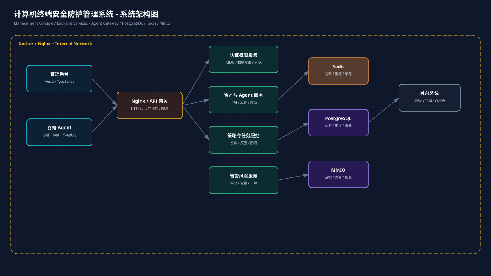
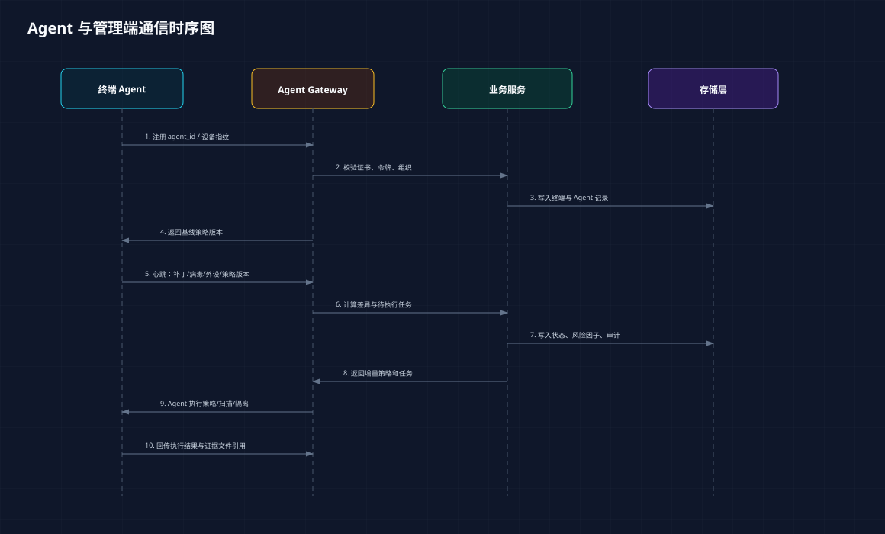
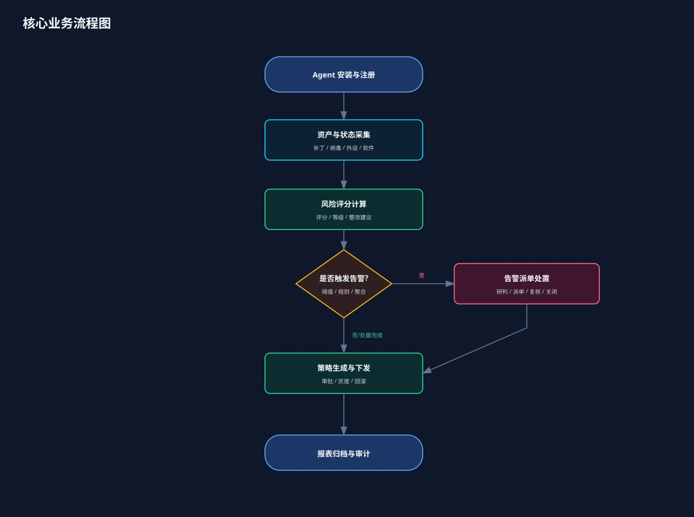

# 系统架构设计

## 1. 架构目标

系统采用“管理后台 + 后端服务 + Agent 通信 + 数据存储 + 文件存储”的分层架构，优先保证可开发、可测试、可部署、可审计。第一阶段使用单体 Spring Boot 服务承载领域模块，后续可按资产、策略、告警、任务、文件、报表拆分服务。

## 2. 技术栈

| 层级 | 技术 | 说明 |
|---|---|---|
| 前端 | Vue 3、TypeScript、Vite | 管理后台、数据看板、表单流程 |
| 后端 | Spring Boot 3、Java 21 | REST API、任务调度、权限审计 |
| 数据库 | PostgreSQL | 终端、策略、告警、审计、任务数据 |
| 缓存 | Redis | 会话、限流、心跳缓存、任务状态 |
| 文件 | MinIO | 证据、隔离文件、补丁包、报表 |
| 部署 | Docker、Nginx | 反向代理、静态资源、服务编排 |
| 协作 | GitHub Actions | CI、PR 检查、验收归档 |

## 3. 总体组件

### 3.1 前端管理后台

- 左侧主导航：安全态势、终端资产、Agent、策略、补丁、病毒防护、外设、白名单、风险、告警、报表、审计。
- 主工作区：表格、筛选、详情抽屉、分步表单、时间线、批量操作。
- 数据层：统一 `request` 封装，处理 API 响应、错误、加载状态。

### 3.2 后端服务

| 模块 | 职责 |
|---|---|
| Auth/RBAC | 登录、令牌、角色权限、数据范围 |
| Endpoint | 终端资产、软硬件清单、在线状态 |
| Agent Gateway | 注册、心跳、事件、策略拉取 |
| Policy | 策略草稿、版本、审批、灰度、回滚 |
| Patch/AV | 补丁状态、病毒库状态、防护状态 |
| Device Control | 外设规则、白名单、违规记录 |
| Software Whitelist | 软件清单、白名单、例外申请 |
| Risk Engine | 风险评分、等级、趋势、整改建议 |
| Alert/Incident | 告警聚合、工单、处置、关闭 |
| File Service | 预签名上传、下载、隔离文件、报表 |
| Report/Audit | 报表、导出、审计日志 |

## 4. Agent 通信

### 4.1 通信原则

- 使用 HTTPS，生产环境建议 mTLS 或设备证书。
- Agent 注册后获取 `agent_id`、租户、策略基线版本。
- 心跳接口轻量化，批量事件接口支持压缩和幂等键。
- 策略拉取使用版本号增量同步，避免每次全量传输。
- 所有执行结果必须有 `task_execution_id`，便于追踪和重试。

### 4.2 核心接口链路

| 链路 | 方向 | 说明 |
|---|---|---|
| 注册 | Agent -> Server | 首次安装绑定终端身份 |
| 心跳 | Agent -> Server | 在线状态、防护状态、策略版本 |
| 资产采集 | Agent -> Server | 软硬件、软件、补丁、病毒库 |
| 事件上报 | Agent -> Server | 告警、违规、策略执行结果 |
| 策略拉取 | Agent <- Server | 增量策略与任务 |
| 文件上传 | Agent -> MinIO/Server | 告警证据、隔离文件 |
| 命令执行 | Agent <- Server | 扫描、隔离、恢复、升级 |

## 5. 核心业务流程

## 6. 数据流

1. Agent 上报心跳、资产、策略执行结果和告警事件。
2. 后端校验证书、签名、幂等键和 Agent 状态。
3. 高频状态写 Redis，结构化业务数据写 PostgreSQL。
4. 文件证据通过预签名 URL 写入 MinIO。
5. 风险引擎按资产、补丁、病毒、防护、告警、外设、白名单计算评分。
6. 告警中心生成处置工单，工单状态变更写审计日志。
7. 报表服务按日/周/月聚合指标并导出文件。

## 7. 风险评分模型

总分 0-100，分数越高风险越大。

| 因子 | 权重 | 计算说明 |
|---|---:|---|
| 高危告警 | 25 | 严重/高危告警未关闭数量和持续时间 |
| 补丁缺失 | 20 | CVSS、超期天数、影响软件 |
| 病毒防护 | 15 | 防护关闭、病毒库过期、扫描失败 |
| Agent 状态 | 10 | 离线时长、版本落后、心跳异常 |
| 外设违规 | 10 | 违规接入次数、阻断失败次数 |
| 软件风险 | 10 | 黑名单软件、未授权软件、白名单偏离 |
| 基线配置 | 10 | 密码、防火墙、远程桌面、共享目录 |

风险等级：

- 0-30：低
- 31-60：中
- 61-85：高
- 86-100：严重

## 8. 可靠性与安全

- API 必须返回统一响应结构、traceId 和错误码。
- 高风险接口需要二次确认或审批。
- 批量操作必须生成任务并可追踪执行结果。
- 策略发布、白名单调整、隔离恢复、报表导出必须写审计日志。
- 文件上传必须限制大小、类型、哈希和访问权限。
- Agent 命令必须校验终端归属和策略版本。
